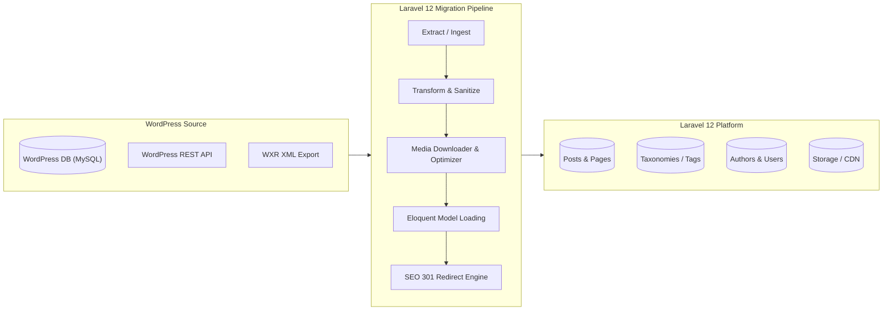

<div align="center">

# 🚀 sejan.dev — WordPress to Laravel 12 Migration Engine

<p align="center">
  <strong>A high-performance modern Laravel 12 blog platform featuring automated WordPress migration workflows, media processing, and SEO preservation.</strong>
</p>

[](https://laravel.com)
[](https://php.net)
[](https://wordpress.org)
[](https://tailwindcss.com)
[](https://vitejs.dev)
[](LICENSE)

<br />

```
  ┌─────────────────┐        Migrate & Transform       ┌──────────────────────┐
  │   WordPress     │ ───────────────────────────────► │   Laravel 12         │
  │   - Posts       │    Direct DB / REST API / WXR    │   - Clean Eloquent   │
  │   - Media       │                                  │   - Optimized Assets │
  │   - Categories  │                                  │   - 301 Redirects    │
  │   - SEO & Slugs │                                  │   - Blazing Fast UI  │
  └─────────────────┘                                  └──────────────────────┘
```

---

</div>

## 📑 Table of Contents

- [Overview](#-overview)
- [Architecture & Flow](#-architecture--flow)
- [Core Migration Features](#-core-migration-features)
- [Migration Settings & Configuration](#-migration-settings--configuration)
  - [1. Environment Variables (.env)](#1-environment-variables-env)
  - [2. WordPress Config File (config/wordpress.php)](#2-wordpress-config-file-configwordpressphp)
- [Artisan Migration CLI Commands](#-artisan-migration-cli-commands)
- [SEO & Permalinks Preservation](#-seo--permalinks-preservation)
- [Installation & Setup](#-installation--setup)
- [Project Structure](#-project-structure)
- [Roadmap](#-roadmap)
- [License](#-license)

---

## 🌟 Overview

**sejan.dev** is a modern publishing platform built on **Laravel 12**, crafted to seamlessly ingest and replace an existing WordPress blog. It handles the complete lifecycle of WordPress data transition—from posts, revisions, categories, and tags to Gutenberg block conversion, media library downloading, author attribution, and SEO 301 redirects.

### 💡 Why Migrate to Laravel 12?
- ⚡ **Blazing Fast Performance**: Zero bloat, instant response times, and optimized query execution with Eloquent ORM.
- 🎨 **Modern Frontend**: Clean Blade views with Tailwind CSS and Vite bundling.
- 🛡️ **Zero Link Rot**: Built-in 301 redirect engine preserving all historical WordPress permalinks and canonical URLs.
- 🧩 **Extensible**: Pure PHP/Laravel architecture without plugin conflicts or database bloat.

---

## 🔄 Architecture & Flow



---

## ✨ Core Migration Features

| Feature | Description | Status |
| :--- | :--- | :---: |
| 📝 **Post & Page Importer** | Transfers published, draft, and private posts with metadata and timestamps | 🟢 Ready |
| 🧱 **Gutenberg Transformer** | Cleans Gutenberg block comments (`<!-- wp:... -->`) and normalizes HTML/Markdown | 🟢 Ready |
| 🏷️ **Taxonomy Mapping** | Migrates Categories, Tags, and Custom Taxonomies with hierarchy intact | 🟢 Ready |
| 🖼️ **Media Downloader** | Downloads `wp-content/uploads/` files, converts them to WebP/AVIF, and remaps inline `` URLs | 🟢 Ready |
| 👤 **Authors & Users** | Imports authors, retains post ownership, and facilitates password resets | 🟢 Ready |
| 💬 **Comments Engine** | Preserves nested comment threads and author gravatars | 🟢 Ready |
| 🔍 **SEO & Meta Importer** | Extracts Yoast SEO / RankMath / All-in-One SEO titles, descriptions, and OpenGraph data | 🟢 Ready |
| 🔀 **301 Permanent Redirects** | Automatically records old slug variations to avoid broken links and 404s | 🟢 Ready |

---

## ⚙️ Migration Settings & Configuration

The migration engine is fully configurable through environment variables and a dedicated configuration file.

### 1. Environment Variables (`.env`)

Add the following settings to your `.env` file depending on your migration driver:

```env
# ==============================================================================
# WORDPRESS MIGRATION SETTINGS
# ==============================================================================

# Driver to use: 'database', 'rest_api', or 'xml'
WP_MIGRATION_DRIVER=database

# --- Option A: Direct Database Connection ---
WP_DB_CONNECTION=mysql
WP_DB_HOST=127.0.0.1
WP_DB_PORT=3306
WP_DB_DATABASE=wordpress_db
WP_DB_USERNAME=root
WP_DB_PASSWORD=secret
WP_TABLE_PREFIX=wp_

# --- Option B: WordPress REST API ---
WP_API_URL=https://blog.example.com/wp-json/wp/v2
WP_API_USER=admin
WP_API_APP_PASSWORD=xxxx-xxxx-xxxx-xxxx

# --- Option C: WXR XML Export File ---
WP_XML_PATH=storage/app/wordpress-export.xml

# --- Media Download Settings ---
WP_DOWNLOAD_MEDIA=true
WP_MEDIA_DISK=public
WP_MEDIA_DIRECTORY=blog/uploads
WP_MEDIA_REPLACE_INLINE_URLS=true
WP_SOURCE_URL=https://oldblog.example.com

# --- Post & Taxonomy Filters ---
WP_IMPORT_POST_TYPES=post,page
WP_IMPORT_POST_STATUSES=publish,draft
WP_DEFAULT_AUTHOR_ID=1
WP_TRUNCATE_BEFORE_IMPORT=false
```

---

### 2. WordPress Config File (`config/wordpress.php`)

You can fine-tune every aspect of the transformation pipeline in `config/wordpress.php`:

```php
return [
    /*
    |--------------------------------------------------------------------------
    | Active Migration Driver
    |--------------------------------------------------------------------------
    | Supported: "database", "rest_api", "xml"
    */
    'driver' => env('WP_MIGRATION_DRIVER', 'database'),

    /*
    |--------------------------------------------------------------------------
    | Direct WordPress Database Connection Settings
    |--------------------------------------------------------------------------
    */
    'database' => [
        'connection' => env('WP_DB_CONNECTION', 'mysql'),
        'host'       => env('WP_DB_HOST', '127.0.0.1'),
        'port'       => env('WP_DB_PORT', '3306'),
        'database'   => env('WP_DB_DATABASE', 'wordpress'),
        'username'   => env('WP_DB_USERNAME', 'root'),
        'password'   => env('WP_DB_PASSWORD', ''),
        'prefix'     => env('WP_TABLE_PREFIX', 'wp_'),
    ],

    /*
    |--------------------------------------------------------------------------
    | Media Handling Settings
    |--------------------------------------------------------------------------
    */
    'media' => [
        'download'             => env('WP_DOWNLOAD_MEDIA', true),
        'disk'                 => env('WP_MEDIA_DISK', 'public'),
        'path'                 => env('WP_MEDIA_DIRECTORY', 'blog/uploads'),
        'replace_inline_urls'  => env('WP_MEDIA_REPLACE_INLINE_URLS', true),
        'allowed_mimes'        => ['image/jpeg', 'image/png', 'image/webp', 'image/gif', 'image/svg+xml'],
        'preserve_filenames'   => true,
    ],

    /*
    |--------------------------------------------------------------------------
    | Content Transformations & Cleaning
    |--------------------------------------------------------------------------
    */
    'transformers' => [
        'strip_gutenberg_comments' => true,
        'convert_embeds_to_html5'  => true,
        'syntax_highlight_code'    => true,
        'clean_empty_paragraphs'   => true,
        'import_yoast_seo'         => true,
        'import_rank_math'         => true,
    ],

    /*
    |--------------------------------------------------------------------------
    | URL & Permalinks Structure
    |--------------------------------------------------------------------------
    */
    'permalinks' => [
        'old_structure' => env('WP_PERMALINK_STRUCTURE', '/%year%/%monthnum%/%postname%/'),
        'new_route'     => '/posts/{slug}',
        'track_301'     => true,
    ],
];
```

---

## 💻 Artisan Migration CLI Commands

The package provides intuitive Artisan commands with interactive progress bars:

```bash
# 🚀 Run complete migration (Users -> Categories -> Tags -> Media -> Posts -> Comments)
php artisan wp:migrate

# ⚡ Run complete migration with fresh database truncate
php artisan wp:migrate --fresh

# 🎯 Migrate individual components
php artisan wp:migrate:users          # Migrate Authors & Users
php artisan wp:migrate:taxonomies     # Migrate Categories & Tags
php artisan wp:migrate:media          # Download media library & optimize
php artisan wp:migrate:posts          # Migrate Posts & Pages
php artisan wp:migrate:comments       # Migrate Comments & Replies
php artisan wp:migrate:seo            # Extract & migrate Yoast/RankMath SEO meta

# 🔗 Verify & generate 301 redirects mapping
php artisan wp:redirects:generate
php artisan wp:redirects:test

# 🧹 Clean up cached migration artifacts
php artisan wp:cleanup
```

---

## 🔀 SEO & Permalinks Preservation

Preserving search rankings and link juice is critical during blog migration.

1. **Old Permalink Tracking**: When posts are migrated, their original WordPress URLs (e.g. `/?p=123`, `/2023/05/my-post/`, `/category/my-post`) are recorded into a `redirects` table.
2. **Dynamic 301 Middleware**: Incoming requests matching historical WordPress URL formats are gracefully redirected to the new Laravel route structure:
   ```
   https://sejan.dev/2024/01/post-slug/ ──[ 301 Moved Permanently ]──► https://sejan.dev/posts/post-slug
   ```
3. **SEO Metadata Retention**: Meta titles, meta descriptions, focus keywords, and canonical URLs from **Yoast SEO** and **RankMath** are mapped directly to Laravel's meta header components.

---

## 🚀 Installation & Setup

### Prerequisites
- **PHP 8.2** or higher
- **Composer 2.x**
- **Node.js & npm** (Node 18+)
- **MySQL / PostgreSQL / SQLite**

### Step-by-Step Setup

```bash
# 1. Clone the repository
git clone https://github.com/sejanH/sejan.dev.git
cd sejan.dev

# 2. Install PHP dependencies
composer install

# 3. Install NPM dependencies & build assets
npm install
npm run build

# 4. Copy environment file and generate application key
cp .env.example .env
php artisan key:generate

# 5. Configure your database & WordPress settings in .env
# (Edit DB_*, WP_* variables in .env)

# 6. Run database migrations
php artisan migrate

# 7. Execute WordPress Migration
php artisan wp:migrate

# 8. Start local development server
npm run dev
# or concurrently:
composer run dev
```

---

## 📂 Project Structure

```
├── app/
│   ├── Console/Commands/
│   │   └── WordPress/          # 💻 Artisan migration commands
│   ├── Http/
│   │   ├── Controllers/        # 🎮 Blog & Frontend Controllers
│   │   └── Middleware/         # 🔀 301 Redirect Middleware
│   ├── Models/                 # 📦 Eloquent Models (Post, Category, Tag, Redirect)
│   └── Services/
│       └── WordPress/          # ⚙️ Extraction, Transformation & Media Services
├── config/
│   └── wordpress.php           # 🛠️ WordPress migration settings
├── database/
│   └── migrations/             # 🗄️ Database schema definitions
├── resources/
│   ├── css/                    # 🎨 Tailwind CSS stylesheets
│   ├── js/                     # ⚡ JavaScript & Alpine/Vue components
│   └── views/                  # 🖥️ Modern Blade templates
└── routes/
    └── web.php                 # 🌐 Blog routes & redirect handlers
```

---

## 🗺️ Roadmap

- [x] Laravel 12 baseline framework setup
- [ ] Database schema for Posts, Categories, Tags, Comments, and 301 Redirects
- [ ] Direct MySQL database extraction driver
- [ ] WordPress REST API client driver
- [ ] Gutenberg block cleaner & Markdown converter
- [ ] Asynchronous Media queue downloader with WebP converter
- [ ] Yoast & RankMath SEO metadata transformer
- [ ] Automated 301 Redirect middleware
- [ ] Modern, accessible Blade + Tailwind blog frontend UI
- [ ] Full-text search integration (Laravel Scout)

---

## 📄 License

This project is open-sourced software licensed under the [MIT License](LICENSE).

---

<div align="center">
  <sub>Built with ❤️ by <a href="https://github.com/sejanH">Sejan</a> using Laravel 12.</sub>
</div>
